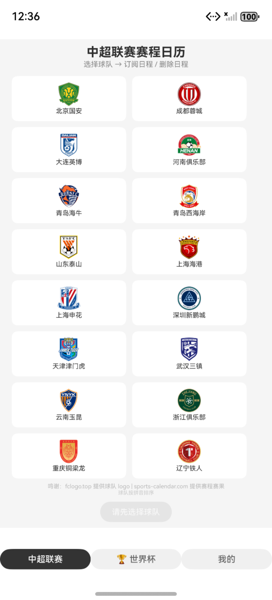
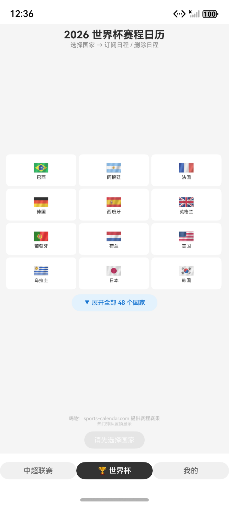
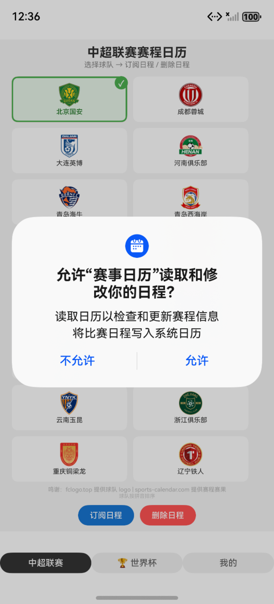
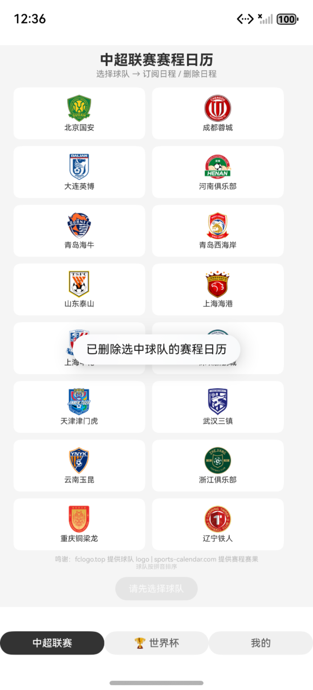
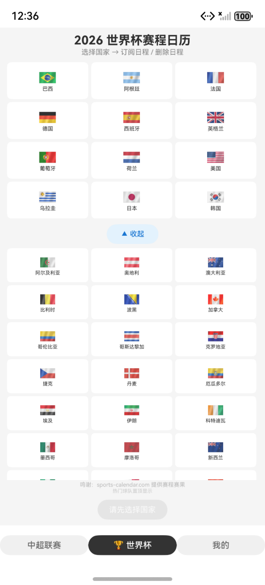
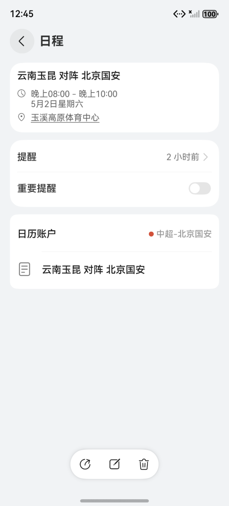

# SportCalendar — 赛事日历

基于 **HarmonyOS NEXT** 的体育赛程订阅工具，支持 **中超联赛** 和 **2026 世界杯** 赛程一键同步到系统日历。


## 截图预览

<table>
<tr>
<td></td>
<td></td>
<td></td>
</tr>
<tr>
<td>中超联赛球队列表</td>
<td>选择球队后一键订阅</td>
<td>世界杯热门 12 强</td>
</tr>
</table>

<table>
<tr>
<td></td>
<td></td>
<td></td>
</tr>
<tr>
<td>展开全部 48 个国家</td>
<td>日历权限授权弹窗</td>
<td>系统日历中的赛事事件</td>
</tr>
</table>

## 功能特性

- **中超联赛** — 16 支球队全覆盖，按拼音排序
- **2026 世界杯** — 48 支参赛国，热门 12 强置顶 + 全部展开
- **一键订阅** — 选球队 → 点订阅 → 赛程自动写入系统日历
- **独立日历** — 每支球队生成独立的系统日历（`中超-{队名}` / `世界杯-{国家名}`），互不干扰
- **赛前提醒** — 默认赛前 2 小时推送通知
- **纯离线** — 无需联网，赛程数据内嵌于应用中
- **权限引导** — 日历权限拒绝后可跳转系统设置重新授权

## 技术栈

| 类别 | 技术 |
|------|------|
| 语言 | ArkTS (TypeScript for HarmonyOS) |
| UI 框架 | ArkUI (声明式 UI) |
| 日历 API | `@kit.CalendarKit` (系统日历读写) |
| 数据加载 | 本地 rawfile (离线 ICS 数据) |
| 数据解析 | 自研 ICS Parser (RFC 5545) |
| 本地存储 | Preferences (`@ohos.data.preferences`) |
| 构建工具 | Hvigor (DevEco Studio 内置) |

## 项目结构

```
SportCalendar/
├── AppScope/                  # 应用级配置
│   └── app.json5            # bundleName, icon, version
├── entry/                     # 主模块
│   ├── src/main/
│   │   ├── ets/
│   │   │   ├── entryability/
│   │   │   │   └── EntryAbility.ets    # UIAbility 入口
│   │   │   ├── pages/
│   │   │   │   ├── Index.ets           # 主页面（Tabs: 中超 | 世界杯 | 我的）
│   │   │   │   ├── PrivacyPolicy.ets   # 隐私协议页
│   │   │   │   └── Changelog.ets       # 版本更新记录
│   │   │   ├── services/
│   │   │   │   ├── CalendarWriter.ets # 日历读写（创建/删除/写入事件）
│   │   │   │   ├── DataService.ets    # 本地 ICS 数据加载
│   │   │   │   ├── IcsParser.ets       # ICS 文件解析器
│   │   │   │   └── TeamStore.ets      # 本地持久化存储
│   │   │   ├── constants/
│   │   │   │   └── Teams.ets          # 球队/国家定义、常量
│   │   │   └── model/
│   │   │       └── MatchEvent.ets      # 赛事事件数据模型
│   │   ├── resources/rawfile/          # 内嵌 ICS 数据（16 CSL + 48 WC）
│   │   └── module.json5         # 权限声明、页面路由
│   └── src/ohosTest/            # 单元测试
├── screenshots/                # 截图
├── oh-package.json5            # 依赖管理（ohpm）
├── build-profile.json5         # 构建配置
├── privacy-policy.html         # 隐私协议（HTML 版，应用商店用）
└── hvigorfile.ts               # Hvigor 构建脚本
```

## 核心架构

### 数据流

```
本地 rawfile ICS 文件
        ↓ (DataService.loadIcs)
    ICS 原始文本
        ↓ (IcsParser.parse)
    MatchEvent[]
        ↓ (CalendarWriter.writeEvents)
    系统日历 (每队/国独立 calendar)
```

### 权限说明

| 权限 | 用途 | 申请时机 |
|------|------|----------|
| `ohos.permission.READ_CALENDAR` | 读取系统日历 | 删除日历时 |
| `ohos.permission.WRITE_CALENDAR` | 写入赛事到日历 | 订阅/删除日历时 |

> 本应用为纯离线单机应用，无需网络权限。

## 数据来源

| 资源 | 提供方 | 用途 |
|------|--------|------|
| 球队 Logo | [fclogo.top](https://fclogo.top) | 16 支中超球队 Logo |
| 赛程数据 | [sports-calendar.com](https://sports-calendar.com) | ICS 格式赛程数据（已内嵌） |

## 安装

### 方式一：应用商店（推荐）

在华为应用市场搜索「**赛事日历**」安装。

### 方式二：手动安装

1. 从 [Releases](https://github.com/BadCoderChou/sport_calendar/releases) 下载最新 `.hap` 文件
2. 手机开启**开发者模式** + **USB 调试**
3. 执行 `hdc install xxx.hap` 或通过 DevEco Studio 安装

## 开发环境要求

- **IDE**: DevEco Studio 6.0+
- **SDK**: HarmonyOS Next API 6.0.2 (22)
- **设备**: 手机/模拟器（需支持日历功能）

## License

MIT
